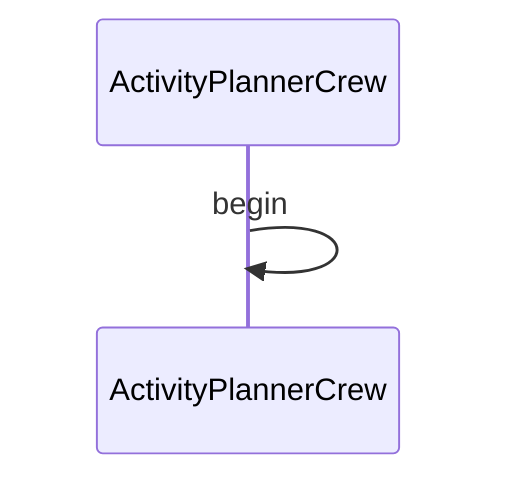

# Activity Planner CrewAI Demo

This demo shows how to use Maestro with CrewAI to create a workflow that plans activities based on user preferences and constraints.

## Prerequisites

* Python 3.12 or higher
* [uv](https://github.com/astral-sh/uv) package manager
* [maestro](https://github.com/AI4quantum/maestro) installed

## Setup

* Install maestro:
    ```bash
    pip install git+https://github.com/AI4quantum/maestro.git@v0.1.0
    ```

## Running

* Run `demos/workflows/activity-planner-crewai.ai/run.sh` via shell command line, or IDE such as vscode

## Caveats

* Demo is incomplete and still being worked on including but not limited to
  * Output from current agent cannot be parsed
* `run.sh`, `doctor.sh`. `setup.sh` are currently not implemented
* Demo is likely to be merged with `../activity-planner.ai`

## Mermaid Diagram

<!-- MERMAID_START -->

<!-- MERMAID_END -->
