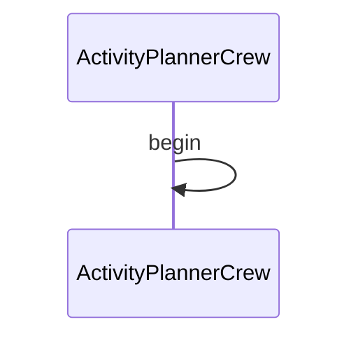

# Activity Planner CrewAI Demo

This demo shows how to use Maestro with CrewAI to create a workflow that plans activities based on user preferences and constraints.

## Prerequisites

* Python 3.12 or higher
* [uv](https://github.com/astral-sh/uv) package manager
* [maestro](https://github.com/AI4quantum/maestro) installed

## Setup

1. Clone the repository:
```bash
git clone https://github.com/AI4quantum/maestro.git
cd maestro
```

2. Install dependencies:
```bash
cd ../../../maestro
uv pip install -e .
cd -
```

## Usage

1. Run the workflow:
```bash
uv run maestro run agents.yaml workflow.yaml
```

2. The workflow will:
   * Collect user preferences
   * Generate activity suggestions
   * Create a schedule
   * Save the results to `output/activity_plan.txt`

## Output

The output will be saved in `output/activity_plan.txt` and will contain:
* Activity suggestions
* Schedule
* Required resources
* Alternative options

## Customization

You can modify the workflow by editing the YAML files in the `workflows/activity-planner-crewai.ai` directory:
* `workflow.yaml`: Main workflow configuration
* `agents/`: Directory containing agent configurations
* `tools/`: Directory containing tool configurations

## Mermaid Diagram

<!-- MERMAID_START -->

<!-- MERMAID_END -->

## Requirements

* Python 3.11/3.12
* uv

## Running

* Run `demos/activity-planner-crewai.ai/run.py` via shell command line, or IDE such as vscode

## Caveats

* Demo is incomplete and still being worked on including but not limited to
  * Output from current agent cannot be parsed
* `run.sh`, `doctor.sh`. `setup.sh` are currently not implemented
* Demo is likely to be merged with `../activity-planner.ai`
