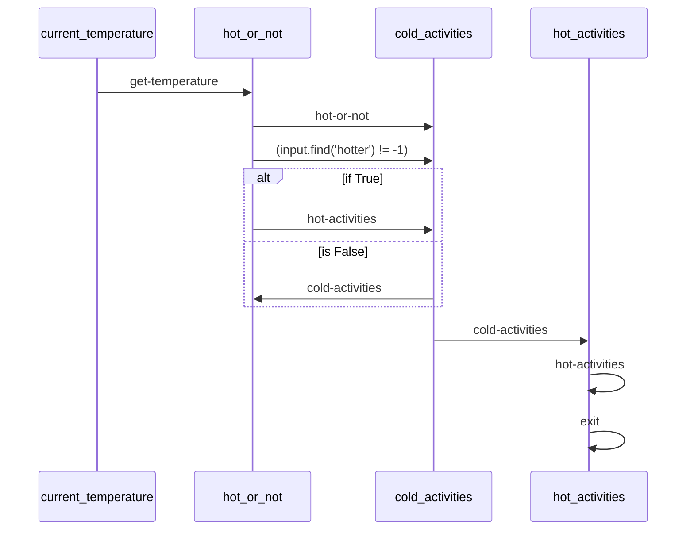

TODO the demo does not currently function out of the box as the workflow schema / automation are not supported by the demo as of yet.  Merging this early and will address after we've moved name/repos.

# Activity Planner Demo

This demo shows how to use Maestro to create an activity planner.

## Prerequisites

* Python 3.12 or higher
* [uv](https://github.com/astral-sh/uv) package manager
* [maestro](https://github.com/AI4quantum/maestro) installed

## Setup

1. Install dependencies:
```bash
cd maestro
uv pip install -e .
cd -
```

2. Run the demo:
```bash
uv run maestro run agents.yaml workflow.yaml
```

## Usage

1. Run the workflow:
```bash
uv run maestro run workflows/activity-planner.ai
```

2. The workflow will:
   * Collect user preferences
   * Generate activity suggestions
   * Create a schedule
   * Save the results to `output/activity_plan.txt`

## Output

The output will be saved in `output/activity_plan.txt` and will contain:
* Activity suggestions
* Schedule
* Required resources
* Alternative options

## Customization

You can modify the workflow by editing the YAML files in the `workflows/activity-planner.ai` directory:
* `workflow.yaml`: Main workflow configuration
* `agents/`: Directory containing agent configurations
* `tools/`: Directory containing tool configurations

## Mermaid Diagram

<!-- MERMAID_START -->

<!-- MERMAID_END -->

## Getting Started

* Run a local instance of the [bee-stack](https://github.com/i-am-bee/bee-stack/blob/main/README.md)

* Verify a valid llm is available to bee-stack

* Install [maestro](https://github.com/AI4quantum/maestro) dependencies: `cd ../../../maestro && poetry shell && poetry install && cd -`

* Configure environmental variables: `cp example.env .env`

* Copy `.env` to common directory: `cp .env ./../common/src`

* Set up the demo and create the agents: `./setup.sh`

* Run the workflow: `./run.sh` (to run for a different city, change the `prompt` field in `workflow.yaml`)
