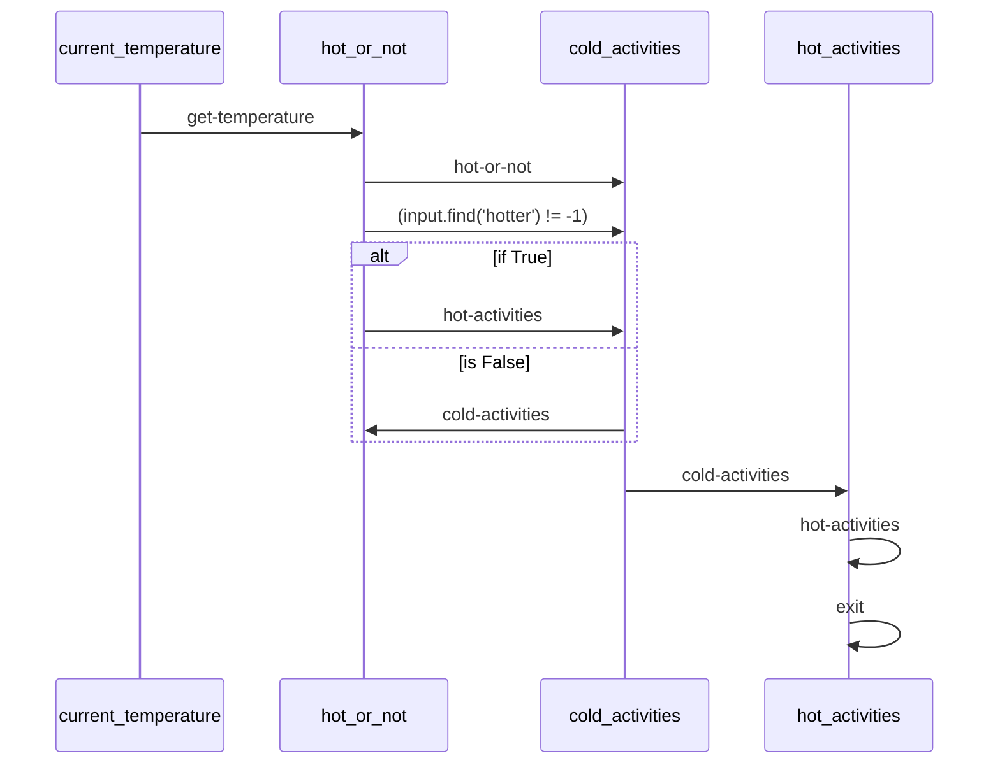

# Activity Planner Demo

This demo shows how to use Maestro to create an activity planner.

**Note**: This demo does not currently function out of the box as the workflow schema / automation are not supported by the demo as of yet. Merging this early and will address after we've moved name/repos.

## Prerequisites

* Python 3.12 or higher
* [uv](https://github.com/astral-sh/uv) package manager
* [maestro](https://github.com/AI4quantum/maestro) installed

## Setup

1. Install maestro:
```bash
pip install git+https://github.com/AI4quantum/maestro.git@v0.1.0
```

2. Run the demo:
```bash
uv run maestro run agents.yaml workflow.yaml
```

## Mermaid Diagram

<!-- MERMAID_START -->

<!-- MERMAID_END -->

## Getting Started

* Run a local instance of the [bee-stack](https://github.com/i-am-bee/bee-stack/blob/main/README.md)

* Verify a valid llm is available to bee-stack

* Install [maestro](https://github.com/AI4quantum/maestro):
   ```bash
   pip install git+https://github.com/AI4quantum/maestro.git@v0.1.0
   ```

* Configure environmental variables: `cp demos/example.env .env`

* Run the workflow: `./run.sh` (to run for a different city, change the `prompt` field in `workflow.yaml`)
