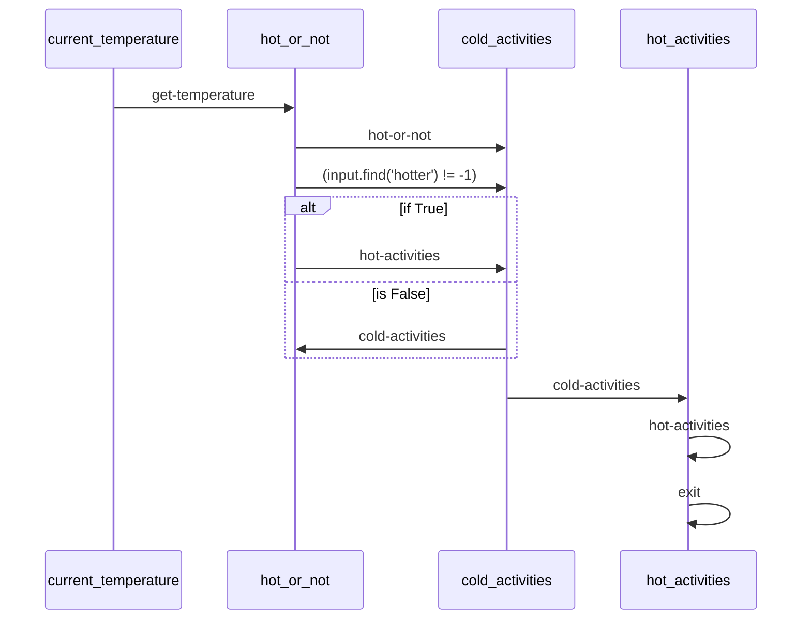

TODO the demo does not currently function out of the box as the workflow schema / automation are not supported by the demo as of yet.  Merging this early and will address after we've moved name/repos.

# Activity-Planner example

A multi-agent workflow using Maestro to check if the current temperature in a location is hotter or colder than average and recommend activities to do based on the weather.

## Mermaid Diagram

<!-- MERMAID_START -->

<!-- MERMAID_END -->

## Getting Started

* Run a local instance of the [bee-stack](https://github.com/i-am-bee/bee-stack/blob/main/README.md)

* Verify a valid llm is available to bee-stack

* Install [maestro](https://github.com/i-am-bee/beeai-labs) dependencies: `cd ../../../maestro && poetry shell && poetry install && cd -`

* Configure environmental variables: `cp example.env .env`

* Copy `.env` to common directory: `cp .env ./../common/src`

* Set up the demo and create the agents: `./setup.sh`

* Run the workflow: `./run.sh` (to run for a different city, change the `prompt` field in `workflow.yaml`)
