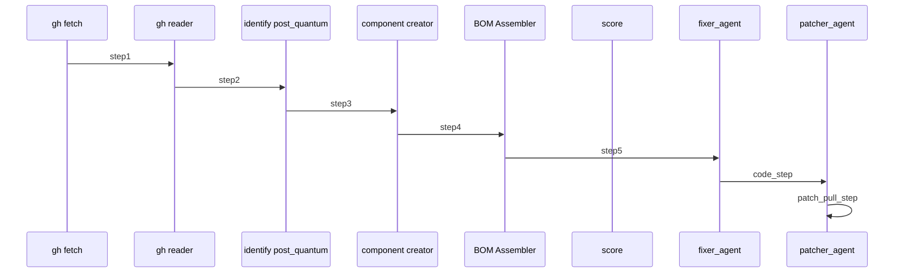

# CBOM.ai — Cryptographic Bill of Materials Demo

This repository contains a Maestro-based proof‑of‑concept that generates a Cryptographic Bill of Materials (CBOM) for a given GitHub Java project. It orchestrates a pipeline of autonomous agents to:

(1) Fetch all .java file URLs from a GitHub repo.

(2) Select a target file at random (or by position).

(3) Read the raw content of that file.

(4) Identify uses of post‑quantum‑vulnerable crypto APIs or functions.

(5) Aggregate findings into CycloneDX‑style component entries.

(6) Assemble a complete CBOM JSON document.

## 📦 Architecture & Agents

### 1. Git Fetcher

Purpose: Recursively list .java files via GitHub’s Trees API.

Output: Python list of raw.githubusercontent URLs.

### 2. Selector

Purpose: Choose one URL from the list (first element or random).

Output: Single URL string.

### 3. Raw GH Reader

Purpose: Fetch full file content via HTTP (requests).

Output: Plain Java source text.

### 4. Post‑Quantum Identifier

Purpose: Scan source for non‑quantum‑safe crypto (AES, RSA, Cipher.getInstance, etc.).

Output: JSON array of occurrences with algorithm, line, snippet.

### 5. Component Creator

Purpose: Group occurrences by algorithm into CycloneDX components.

Output: JSON array of component objects with bom-ref, evidence, cryptoProperties.

### 6. BOM Assembler

Purpose: Wrap header, metadata, components, dependencies into a final CBOM.

Output: Complete CycloneDX BOM JSON document.

## Remediation and PR automation

After generating a CycloneDX-formatted CBOM, the system can optionally apply automated remediations and open a GitHub pull request(s) with the proposed fixes.

### 7. Fixer Agent

Parses the CBOM to identify components using non-recommended configurations (e.g., AES-128).

Applies remediation strategies from LLM-based suggestions to upgrade values (e.g., 128 → 256).

Generates a .patch file using git format-patch from the staged change.

### 8. Patcher Agent

Takes the generated patch and applies it to a clean clone of the target GitHub repository.

Pushes the changes to a new branch (e.g., remediation_4821).

Uses the GitHub CLI (gh pr create) to open a pull request into the original repo’s main branch.

#### Permissions & Token Requirements

To apply patches and create pull requests, the following permissions are required:

A GitHub Personal Access Token (PAT) with the repo scope.

The token must be exported as an environment variable:

```bash
export GITHUB_TOKEN=ghp_...
```

### Mermaid Diagram

<!-- MERMAID_START -->

<!-- MERMAID_END -->

#### Running

This demo uses the ollama backend, and specifically both the `qwen3:latest` and `granite3.2:latest` models. 

In addition, there are 2 custom tools that need to be created and enabled:
(1) java-fetcher

```python
    import requests

    def get_java_file_urls(owner: str, repo: str, branch: str = "main") -> list[str]:
        """
        Retrieve raw.githubusercontent.com URLs for all .java files in a GitHub repo
        by using the Git Trees API with recursion.

        :param owner: GitHub org/user name (e.g., "Mastercard")
        :param repo: Repository name (e.g., "client-encryption-java")
        :param branch: Branch name (default: "main")
        :param token: GitHub Personal Access Token (optional for private repos or rate limiting)
        :return: List of raw.githubusercontent.com URLs for each .java file
        """
        
        tree_api_url = f"https://api.github.com/repos/{owner}/{repo}/git/trees/{branch}?recursive=1"
    
        response = requests.get(tree_api_url)
        response.raise_for_status()
        tree_data = response.json().get("tree", [])
        
        java_urls = []
        for entry in tree_data:
            if entry.get("type") == "blob" and entry.get("path", "").endswith(".java"):
                raw_url = f"https://raw.githubusercontent.com/{owner}/{repo}/{branch}/{entry['path']}"
                java_urls.append(raw_url)
        
        return java_urls
```

(2) fetch_code

```python
    import requests

    def fetch_raw_file_content(url: str) -> str:
        """
        Fetch the full content of a raw.githubusercontent.com URL using HTTP.

        :param url: Raw file URL (e.g., https://raw.githubusercontent.com/.../AesEncrypter.java)
        :return: The file content as a text string
        """
        response = requests.get(url)
        response.raise_for_status()
        return response.text
```

To run: `maestro run ./demos/workflows/cbom.ai/workflow.yaml`
