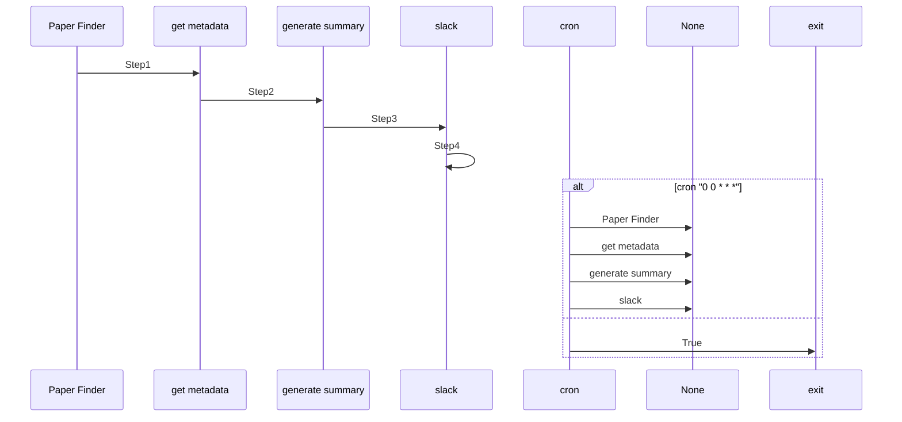

# IBM Summary Demo

This demo shows how to use Maestro to create a summary of IBM's business.

## Setup

1. Install dependencies:
```bash
cd maestro
uv pip install -e .
cd -
```

2. Run the demo:
```bash
uv run maestro run agents.yaml workflow.yaml
```

2. The workflow will:
   * Download IBM's latest financial report
   * Extract key information
   * Generate a summary
   * Save the results to `output/ibm_summary.txt`

## Output

The output will be saved in `output/ibm_summary.txt` and will contain:
* Company overview
* Financial highlights
* Key metrics
* Future outlook

## Customization

You can modify the workflow by editing the YAML files in the `workflows/ibm-summary.ai` directory:
* `workflow.yaml`: Main workflow configuration
* `agents/`: Directory containing agent configurations
* `tools/`: Directory containing tool configurations

## Mermaid Diagram

<!-- MERMAID_START -->

<!-- MERMAID_END -->

## Getting Started

* Run a local instance of the [bee-stack](https://github.com/AI4quantum/bee-stack/blob/main/README.md)

* Verify a valid llm is available to bee-stack

* Install [maestro](https://github.com/AI4Quantum/maestro) dependencies: `cd ../../../maestro && uv venv && source .venv/bin/activate && uv pip install -e . && cd -`

* Configure environmental variables: `cp example.env .env`

* Copy `.env` to common directory: `cp .env ./../common/src`

## Running the Workflow

Assuming you are in maestro top level:

* Creating the agents(with the ability to manually add tools): `maestro create ./demos/workflows/ibm-summary.ai/agents.yaml`

To run the workflow:

If you already created the agents and enabled necessary tools: `maestro run ./demos/workflows/ibm-summary.ai/workflow.yaml`

### NOTE: Custom Tools Required for this Demo

Go into the UI and make 2 tools for this demo:

#### Name: ibm-arXiv

Code:

```Python
import arxiv
import feedparser
from datetime import datetime, timedelta, timezone
from typing import List, Dict
from urllib.parse import urlencode

def find_ibm_papers(category: str, since_days: int) -> List[Dict]:
    """
    Search ArXiv in `category`, pre-filter by abstract keywords, then
    post-filter by author affiliation tags—handling URL encoding properly.
    """

    ibm_keywords = ["ibm", "watson", "powerai", "ibm research"]

    cutoff = datetime.now(timezone.utc) - timedelta(days=since_days)
    abs_filter = " OR ".join(f'abs:"{kw}"' for kw in ibm_keywords)
    query = f"cat:{category} AND ({abs_filter})"
    params = {
        "search_query": query,
        "start": 0,
        "max_results": 100,
        "sortBy": "submittedDate",
        "sortOrder": "descending",
    }
    base_url = "http://export.arxiv.org/api/query?"
    url = base_url + urlencode(params)

    feed = feedparser.parse(url)
    papers = []

    for entry in feed.entries:
        published = datetime(*entry.published_parsed[:6], tzinfo=timezone.utc)
        if published < cutoff:
            continue

        abstract = entry.summary.lower()
        keyword_match = any(kw.lower() in abstract for kw in ibm_keywords)

        affs = entry.get("arxiv_affiliation", [])
        affiliation_match = any("ibm" in aff.lower() for aff in affs)

        if not (keyword_match or affiliation_match):
            continue

        papers.append(entry.title)

    return papers
```

#### Name: get_metadata

Code:

```Python
import arxiv
from typing import Optional

def get_metadata_by_title(title: str) -> Optional[str]:
    """
    Given the exact title of an arXiv paper, fetch its abstract.
    Returns None if no match is found.
    """
    client = arxiv.Client()
    search = arxiv.Search(
        query=f'ti:"{title}"',
        max_results=1
    )
    result = next(client.results(search), None)
    if not result:
        return None
    return {
        "title":     result.title,
        "authors":   [a.name for a in result.authors],
        "published": result.published.strftime("%Y-%m-%d"),
        "abstract":  result.summary.strip()
    }
```
