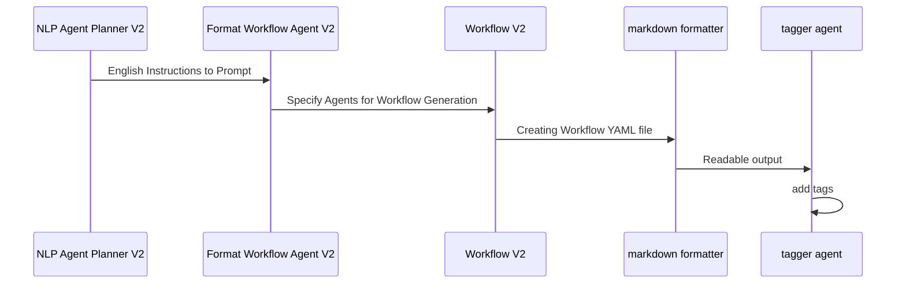

# Meta agent demos

This folder holds the generated `agents.yaml` and `workflow.yaml` files for the meta agent demos.

Validate the agent file: `maestro validate ./schemas/agent_schema.json ./demos/workflows/meta-agents/DEMO_NAME/FOLDER_NAME/agents.yaml`

Creating the agents(with the ability to manually add tools): `maestro create ./demos/workflows/meta-agents/DEMO_NAME/FOLDER_NAME/agents.yaml`

If you already created the agents and enabled the tool: `maestro run None ./demos/workflows/meta-agents/DEMO_NAME/FOLDER_NAME/workflow.yaml`

## Tools Needed to be Created

agent_schema tool: create by copying the code portion in the agents.yaml file into the tool. This is inside `./weather/agent` and `./weather/workflow`

## Mermaid Diagram of Agent Generation Workflow

<!-- MERMAID_START -->
```mermaid
sequenceDiagram
participant NLP Agent Planner V2
participant Format Input Agent V2
participant Create Agent YAML V2
participant markdown formatter
participant tagger agent
NLP Agent Planner V2->>Format Input Agent V2: English Instructions to Prompt
Format Input Agent V2->>Create Agent YAML V2: Specify Agents for Agent Generation
Create Agent YAML V2->>markdown formatter: Creating Agent YAML Workflow
markdown formatter->>tagger agent: Readable output
tagger agent->>tagger agent: add tags
```
<!-- MERMAID_END -->

## Mermaid Diagram of Workflow Generation Workflow

<!-- MERMAID_START -->

<!-- MERMAID_END -->