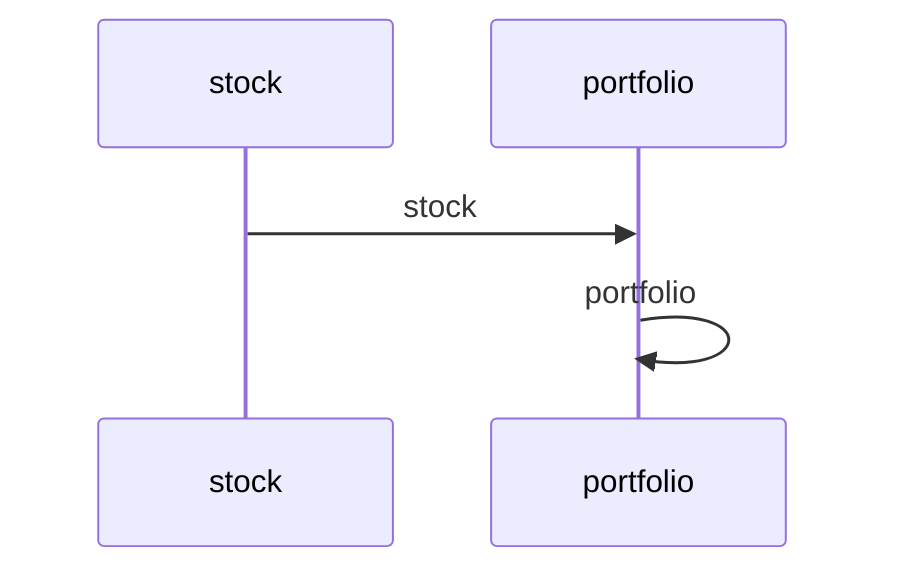

# Quantum Portfolio Optimizer Example

A multi-agent workflow using Maestro: Allows user to select a set of stock then the quantum portfolio optimizer makes the optimized portfolio with the stocks

## Mermaid Diagram

<!-- MERMAID_START -->

<!-- MERMAID_END -->

## Getting Started

* Install [maestro](https://github.com/AI4quantum/maestro) dependencies: `cd ../../../maestro && poetry shell && poetry install && cd -`

* Configure environmental variables: `cp example.env .env`

* Copy `.env` to common directory: `cp .env ./../common/src`

## Running the Workflow

Assuming you are in maestro top level:

`maestro deploy demos/workflows/portfolio/agent.yaml demos/workflows/portfolio/workflow.yaml` 

# Portfolio Demo

This demo shows how to use Maestro to create a portfolio management system.

## Setup

1. Install dependencies:
```bash
cd maestro
uv pip install -e .
uv pip install yfinace
uv pip install qiskit-ibm-catalog
cd -
```

This demo is using a mock function for the Quantum Portfolio Optimizer for easy try.  The following changes are necessary to run the Quantum Portfolio Optimizer in a real quantum computer.

Uncomment these 4 lines and replace `IQP token` with the token for IBM Quantum Platform
```
    #catalog = QiskitFunctionsCatalog(
    #        token='IQP token'
    #)
    #dpo_solver = catalog.load("global-data-quantum/quantum-portfolio-optimizer")
```

In the following lines. Comment out `dpo_job = mock_run(` and uncomment `#dpo_job = dpo_solver.run(`.  If your instance and channel are different, change the values.
```
    dpo_job = mock_run(
    # For not mock case
    #dpo_job = dpo_solver.run(  
      assets=assets,
      qubo_settings=qubo_settings,
      instance='project-based/internal/functions',
      channel='ibm_quantum',
    )
```

2. Run the demo:
```bash
uv run maestro run demos/workflows/portfolio/agent.yaml demos/workflows/portfolio/workflow.yaml
```


