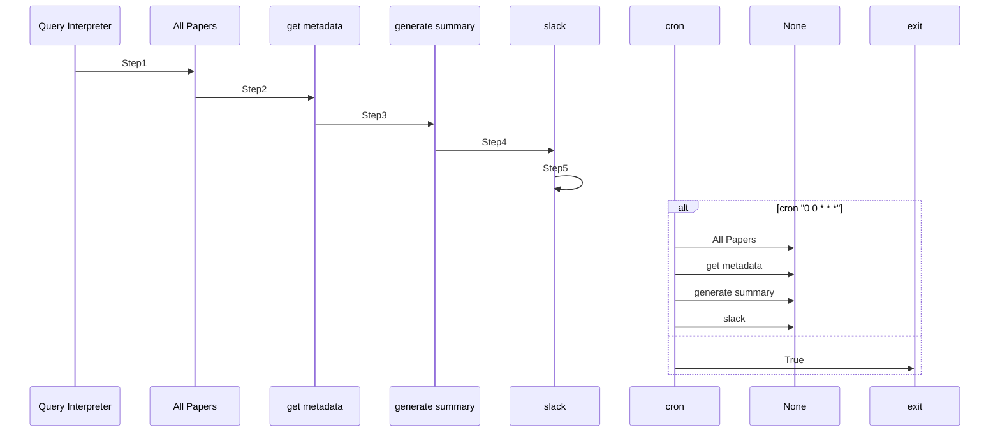

# Summary.ai Example

A multi-agent workflow using Maestro: Allows user to retrieve the latests ArXiV papers by category (arxiv tags). Then, generates a summary from metadata and abstract that is retrieved and gets sent to slackbot.

## Mermaid Diagram

<!-- MERMAID_START -->

<!-- MERMAID_END -->

## Getting Started

* Run a local instance of the [bee-stack](https://github.com/i-am-bee/bee-stack/blob/main/README.md)

* Verify a valid llm is available to bee-stack

* Install [maestro](https://github.com/i-am-bee/beeai-labs) dependencies: `cd ../../../maestro && poetry shell && poetry install && cd -`

* Configure environmental variables: `cp example.env .env`

* Copy `.env` to common directory: `cp .env ./../common/src`

## Running the Workflow

Assuming you are in maestro top level:

* Creating the agents(with the ability to manually add tools): `maestro create ./demos/workflows/summary.ai/agents.yaml`

To run the workflow:

If you already created the agents and enabled necessary tools: `maestro run ./demos/workflows/summary.ai/workflow.yaml`

### NOTE: Custom Tools Required for this Demo

Go into the UI and make 2 tools for this demo:

#### Name: Fetch Papers

Code:

```Python
import urllib.request
import xml.etree.ElementTree as ET
from datetime import datetime, timedelta

def fetch_arxiv_papers(subject: str, max_results: int = 25) -> list[str]:
    """
    Fetches titles of papers in the given arXiv subject that were
    submitted *yesterday* (UTC).

    Args:
        subject (str): e.g. "cs.AI", "quant-ph", etc.
        max_results (int): how many recent papers to fetch for filtering.

    Returns:
        A list of paper titles submitted yesterday.
    """
    yesterday = (datetime.utcnow().date() - timedelta(days=1)).isoformat()
    url = (
        "http://export.arxiv.org/api/query?"
        f"search_query=cat:{subject}"
        f"&sortBy=submittedDate"
        f"&sortOrder=descending"
        f"&max_results={max_results}"
    )
    with urllib.request.urlopen(url) as resp:
        xml_data = resp.read()
    root = ET.fromstring(xml_data)
    ns = {"atom": "http://www.w3.org/2005/Atom"}

    titles = []
    for entry in root.findall("atom:entry", ns):
        pub = entry.find("atom:published", ns).text
        if pub.startswith(yesterday):
            title = entry.find("atom:title", ns).text.strip().replace("\n", " ")
            titles.append(title)

    return titles
```

#### Name: get_metadata

Code:

```Python
import arxiv
from typing import Optional

def get_metadata_by_title(title: str) -> Optional[str]:
    """
    Given the exact title of an arXiv paper, fetch its abstract.
    Returns None if no match is found.
    """
    client = arxiv.Client()
    search = arxiv.Search(
        query=f'ti:"{title}"',
        max_results=1
    )
    result = next(client.results(search), None)
    if not result:
        return None
    return {
        "title":     result.title,
        "authors":   [a.name for a in result.authors],
        "published": result.published.strftime("%Y-%m-%d"),
        "abstract":  result.summary.strip()
    }
```
