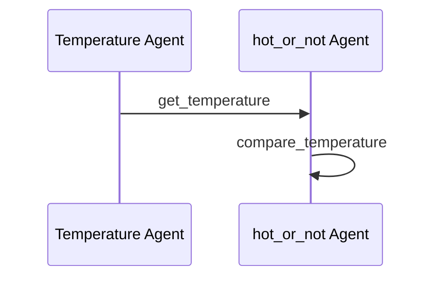

# Weather Checker Demo

This demo shows how to use Maestro to create a workflow that checks and reports weather conditions.

## Prerequisites

* Python 3.12 or higher
* [uv](https://github.com/astral-sh/uv) package manager
* [maestro](https://github.com/AI4quantum/maestro) installed

## Setup

1. Clone the repository:
```bash
git clone https://github.com/AI4quantum/maestro.git
cd maestro
```

2. Install dependencies:
* Install [maestro](https://github.com/AI4quantum/maestro) dependencies: `cd ../../../maestro && uv pip install -e . && cd -`

## Usage

1. Run the workflow:
```bash
uv run maestro run workflows/weather-checker.ai
```

2. The workflow will:
   * Get current weather data
   * Generate a weather report
   * Provide recommendations
   * Save the results to `output/weather_report.txt`

## Output

The output will be saved in `output/weather_report.txt` and will contain:
* Current conditions
* Forecast
* Weather alerts
* Activity recommendations

## Customization

You can modify the workflow by editing the YAML files in the `workflows/weather-checker.ai` directory:
* `workflow.yaml`: Main workflow configuration
* `agents/`: Directory containing agent configurations
* `tools/`: Directory containing tool configurations

## Mermaid Diagram

<!-- MERMAID_START -->

<!-- MERMAID_END -->

## Getting Started

* Run a local instance of the [bee-stack](https://github.com/AI4quantum/bee-stack/blob/main/README.md)

* Verify a valid llm is available to bee-stack

* Configure environmental variables: `cp example.env .env`

* Copy `.env` to common directory: `cp .env ./../common/src`

## Running workflow

Assuming you are in maestro level:

Create the agents (and enable the tools): `maestro create ./demos/workflows/weather-checker.ai/agents.yaml`

To run the workflow:

If you already created the agents and enabled the tool: `maestro run ./demos/workflows/weather-checker.ai/workflow.yaml`

OR

Directly deploy the workflow via streamlit: `maestro deploy ./demos/workflows/weather-checker.ai/agents.yaml ./demos/workflows/weather-checker.ai/workflow.yaml`
(To run for a different city, change the `prompt` field in `workflow.yaml`, or directly as a prompt in the UI)

## Setup

1. Install dependencies:
```bash
cd maestro
uv pip install -e .
cd -
```

2. Run the demo:
```bash
uv run maestro run agents.yaml workflow.yaml
```
