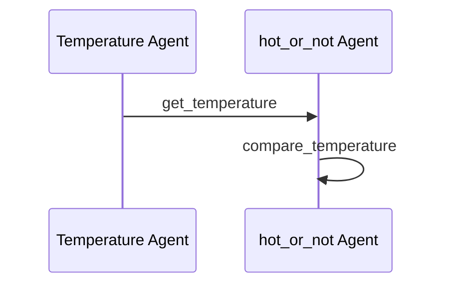

# Weather Checker Demo

This demo shows how to use Maestro to create a workflow that checks and reports weather conditions.

## Prerequisites

* Python 3.12 or higher
* [uv](https://github.com/astral-sh/uv) package manager
* [maestro](https://github.com/AI4quantum/maestro) installed
* A local instance of the [bee-stack](https://github.com/AI4quantum/bee-stack/blob/main/README.md)


## Setup

Install maestro:
```bash
pip install git+https://github.com/AI4quantum/maestro.git@v0.1.0
```

## Mermaid Diagram

<!-- MERMAID_START -->

<!-- MERMAID_END -->

## Getting Started

* Run a local instance of the [bee-stack](https://github.com/AI4quantum/bee-stack/blob/main/README.md)

* Verify a valid llm is available to bee-stack

* Configure environmental variables: `cp demos/example.env .env`

## Running workflow

Assuming you are in maestro level:

Create the agents (and enable the tools):
```bash
maestro create ./demos/workflows/weather-checker.ai/agents.yaml
```

To run the workflow:

If you already created the agents and enabled the tool:
```bash
maestro run ./demos/workflows/weather-checker.ai/workflow.yaml
```

OR

Directly deploy the workflow via streamlit:
```bash
maestro deploy ./demos/workflows/weather-checker.ai/agents.yaml ./demos/workflows/weather-checker.ai/workflow.yaml
```
(To run for a different city, change the `prompt` field in `workflow.yaml`, or directly as a prompt in the UI)


### Scoring

By default, the scoring agent is turned off. Uncomment to turn on, make sure to set `COMET_API_KEY` in the `.env` file; and view log traces in [Opik](https://www.comet.com/opik/).