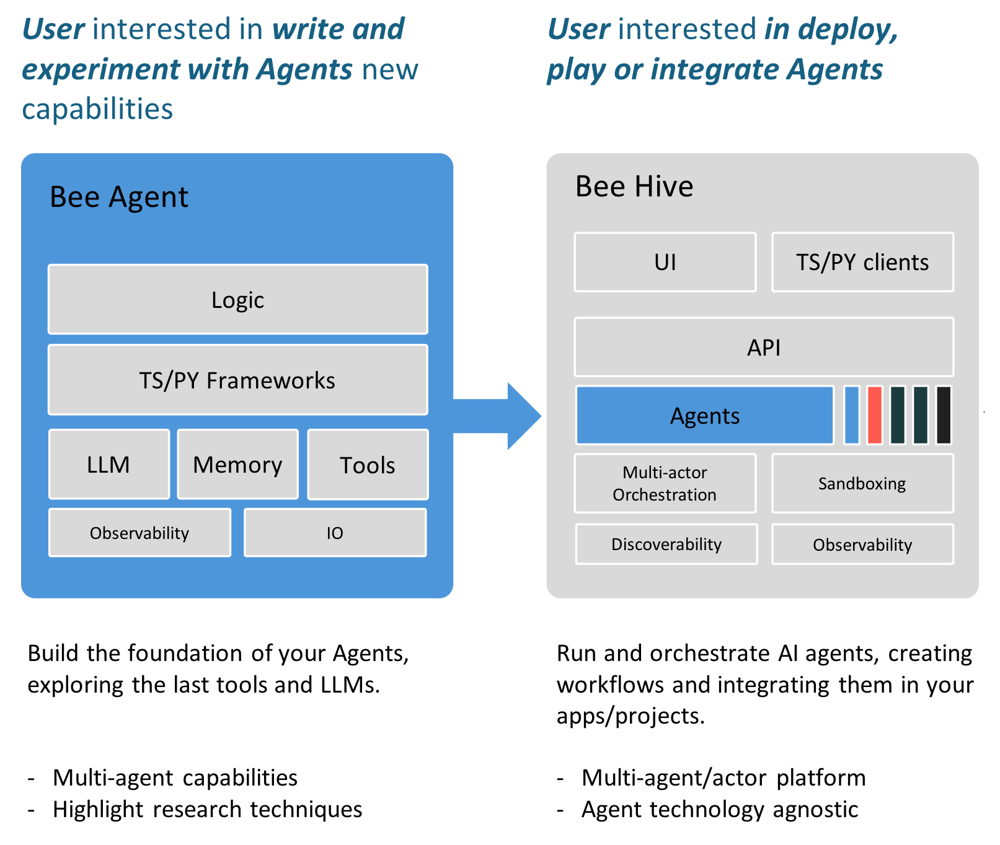
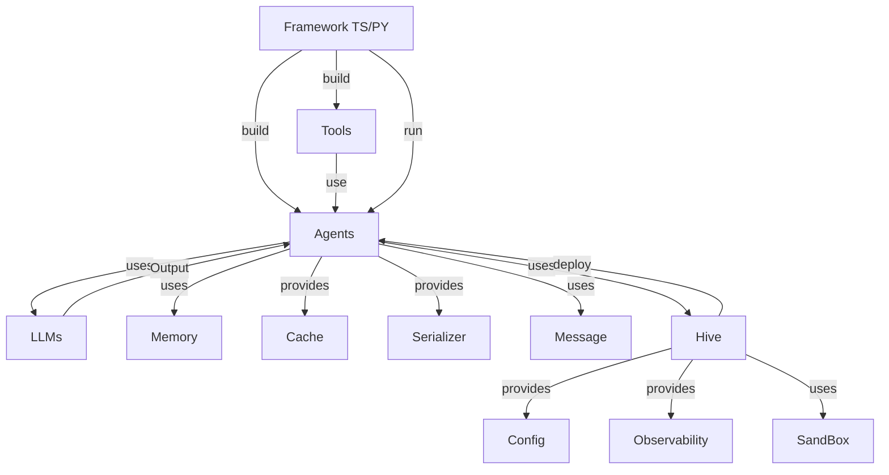

# Comprehensive Overview
The Bee AI is a collection of multiple components and tools. This documentation provides a high-level overview of the project, including its architecture, design, and key components.

## Introduction
The Bee AI project is base in a AI Agent Framework and a multi-agent platform designed to build, deploy, and serve powerful agentic workflows at scale. The framwork is focus in the creation of AI Agents and the platform help to deploy, run and orchestration these AI agents powered by popular LLMs.

## Project Structure
The project is structured into several repositories. The main directories are:
- `framework`: This directory link the core framework of the project, including the `bee-py` and `bee-ts` implementations. [Docs](framework.bee_agent_module_documentation.md)
- `bee-hive`: This directory contains the main application code. [Docs](/docs/hive.high-level_component_interactions.md)

Also you can find extras as:
- `docs`: This directory contains documentation and assets for the project.
- `tools`: This directory contains scripts and tools for the project.
- `examples`: This directory contains example code and configurations for the project.

## Architecture
The architecture of the Bee AI projects is represented in the following diagram:

## Components
You can find several components and tools, including:
- `Agents`: These are the main actors in the system, responsible for performing tasks and interacting with the environment.
- `LLMs`: These are large language models that provide output and interact with the agents.
- `Memory`: This component provides a cache and serialization mechanism for the system.
- `Cache`: This component provides a caching mechanism for the system.
- `File Cache`: This component provides a file-based caching mechanism for the system.
- `Sliding Cache`: This component provides a sliding window caching mechanism for the system.
- `Unconstrained Cache`: This component provides an unconstrained caching mechanism for the system.
- `Serializer`: This component provides a serialization mechanism for the system.
- `Message`: This component provides a messaging mechanism for the system.
- `Task Map`: This component provides a task mapping mechanism for the system.
- `Events`: This component provides an event handling mechanism for the system.
- `Roles`: This component provides a role-based access control mechanism for the system.
- `Config`: This component provides a configuration mechanism for the system.
- `Custom Logger`: This component provides a custom logging mechanism for the system.

## Example Use Cases
The Bee can be used in a variety of scenarios, including:
- Simple Agent implementation using tools: The project can be used to check the weather using the `weather.py` script.
- Agent creation/deployment: The project can be used to create agents using the `create_agents.py` script.
- Workflow execution: The project can be used to execute workflows using the `run_workflow.py` script.

    