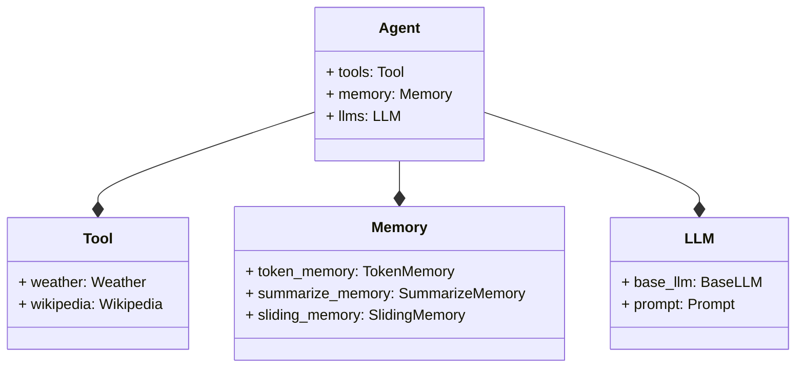

# Bee Agent Module Documentation
This document provides detailed documentation of the bee_agent module, including its classes, functions, and methods.

## System Architecture and Key Design Decisions
The bee_agent module is designed to provide a flexible and modular architecture for building agents. The module is organized into several sub-modules, including tools, memory, llms, and agents.

### Architecture Diagrams
The following diagram shows the high-level architecture of the bee_agent module:

This diagram shows the relationships between the different classes in the bee_agent module.

### Agents
The agents sub-module provides a set of classes for building agents, including a base agent class and a runner class.

> [LLMs Agents](framework.bee_agent_module_documentation.md)

### LLMs
The llms sub-module provides a set of classes for working with large language models, including a base LLM class and a prompt class.

> [LLMs Docs](framework.llms_module_documentation.md)

### Tools
The tools sub-module provides a set of utility functions for tasks such as weather forecasting and Wikipedia queries.

> [Tools Docs](framework.tools_module_documentation.md)

### Memory
The memory sub-module provides a set of classes for managing agent memory, including token memory, summarize memory, and sliding memory.

> [Memory Docs](framework.memory_module_documentation.md)

## Examples
The examples sub-module provides a set of example code for using the bee_agent module, including examples for basic agent usage, LLM usage, and tool usage.

> [Examples](/examples/)