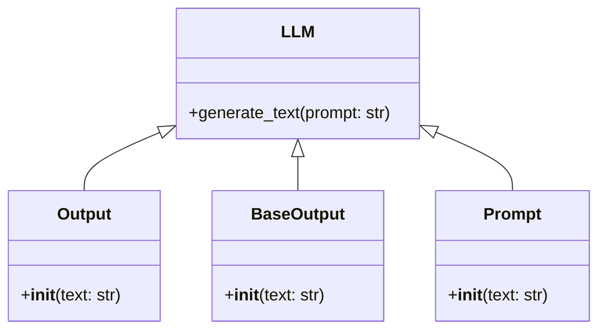

# LLMs Module Documentation
The LLMs module is a crucial component of the bee-hive project, providing the functionality for large language models. This documentation aims to provide a detailed understanding of the llms module and how to use it effectively.

## Overview
The llms module is located in the `workdir/bee-hive/framework/bee-py/bee_agent/llms` directory. It contains the following files:
- `llm.py`: This file contains the base class for large language models.
- `output.py`: This file contains the output class for large language models.
- `base_output.py`: This file contains the base output class for large language models.
- `__init__.py`: This file initializes the llms module.
- `prompt.py`: This file contains the prompt class for large language models.

## Setup Instructions
To use the llms module, you need to have the bee-hive project set up on your local machine. You can do this by cloning the repository and following the instructions in the `README.md` file.

## Example Usage
Here is an example of how to use the llms module:
```python
from bee_agent.llms import LLM

# Create an instance of the LLM class
llm = LLM()

# Use the llm instance to generate text
text = llm.generate_text("This is a prompt")
```

## mermaid Art Diagrams
The following mermaid art diagram shows the relationship between the classes in the llms module:

This diagram shows that the `LLM` class is the base class, and it has methods to generate text. The `Output`, `BaseOutput`, and `Prompt` classes inherit from the `LLM` class.

## Code Examples
The following code example shows how to use the `generate_text` method of the `LLM` class:
```python
from bee_agent.llms import LLM

def generate_text(prompt: str) -> str:
    llm = LLM()
    return llm.generate_text(prompt)

# Test the function
print(generate_text("This is a test prompt"))
```
This code example creates an instance of the `LLM` class and uses it to generate text based on a prompt. The generated text is then printed to the console.

## Conclusion
In conclusion, the llms module is a powerful tool for working with large language models. It provides a simple and intuitive API for generating text based on prompts. With this documentation, you should be able to use the llms module effectively in your own projects.