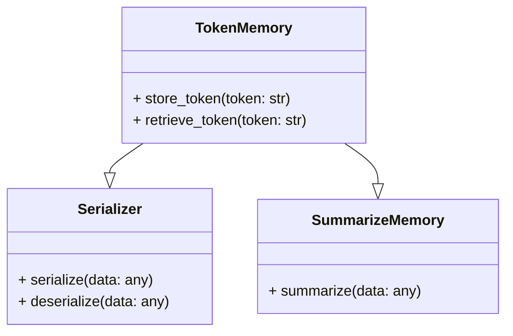

# Memory Module Documentation
The Memory Module is a crucial component of the bee-hive project, responsible for managing and storing data. This documentation provides a detailed overview of the Memory Module, its classes, functions, and methods.

## Introduction
The Memory Module is designed to provide a flexible and efficient way to store and retrieve data. It consists of several classes and functions that work together to manage memory.

## Classes and Functions
The Memory Module includes the following classes and functions:

* `token_memory.py`: This class provides a basic implementation of a token-based memory system.
* `serializer.py`: This class is responsible for serializing and deserializing data.
* `summarize_memory.py`: This class provides a way to summarize and condense memory data.
* `unconstrained_memory.py`: This class provides an implementation of an unconstrained memory system.
* `base_memory.py`: This class provides a basic implementation of a memory system.
* `sliding_cache.py`: This class provides a sliding cache implementation.
* `readonly_memory.py`: This class provides a read-only memory implementation.
* `task_map.py`: This class provides a task mapping implementation.
* `exceptions.py`: This class provides custom exceptions for the Memory Module.
* `serializable.py`: This class provides a serializable interface.
* `message.py`: This class provides a message implementation.

## Code Examples
Here are some examples of how to use the Memory Module:
```python
from bee_agent.memory.token_memory import TokenMemory

# Create a token memory instance
token_memory = TokenMemory()

# Store a token in memory
token_memory.store_token("example_token")

# Retrieve a token from memory
token = token_memory.retrieve_token("example_token")
```

## Setup Instructions
To use the Memory Module, follow these steps:

1. Install the required dependencies.
2. Import the relevant classes and functions.
3. Create an instance of the desired memory class.
4. Use the instance to store and retrieve data.

## Mermaid Diagrams
Here is a mermaid diagram showing the relationships between the different classes and functions in the Memory Module:

This diagram shows the relationships between the `TokenMemory`, `Serializer`, and `SummarizeMemory` classes. The `TokenMemory` class uses the `Serializer` class to serialize and deserialize data, and it also uses the `SummarizeMemory` class to summarize memory data.