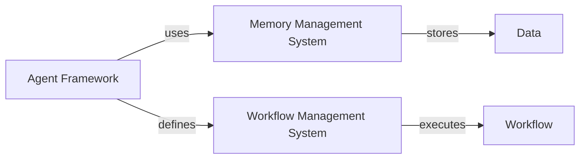

# System Architecture and Key Design Decisions
The bee-hive project is designed to provide a framework for creating and managing agents that can perform various tasks. The system architecture consists of several components, including the agent framework, the memory management system, and the workflow management system.

## Agent Framework
The agent framework is responsible for defining the structure and behavior of the agents. It provides a set of tools and libraries that can be used to create and manage agents. The framework is written in Python and uses the poetry package manager to manage dependencies.

```python
# Example of an agent definition
from bee_agent import Agent

class MyAgent(Agent):
    def __init__(self):
        super().__init__()
        self.tools = ["weather", "wikipedia"]

    def run(self):
        # Code to run the agent
        pass
```

## Memory Management System
The memory management system is responsible for managing the memory of the agents. It provides a set of libraries and tools that can be used to store and retrieve data from the memory. The system uses a combination of in-memory and file-based storage to manage the data.

```python
# Example of using the memory management system
from bee_agent.memory import Memory

memory = Memory()
memory.store("key", "value")
value = memory.retrieve("key")
```

## Workflow Management System
The workflow management system is responsible for managing the workflows of the agents. It provides a set of libraries and tools that can be used to define and execute workflows. The system uses a YAML-based configuration file to define the workflows.

```yml
# Example of a workflow definition
workflows:
  - name: my_workflow
    agents:
      - my_agent
    steps:
      - run: my_agent
```

## Diagrams
The following mermaid art diagram shows the high-level architecture of the bee-hive project:

