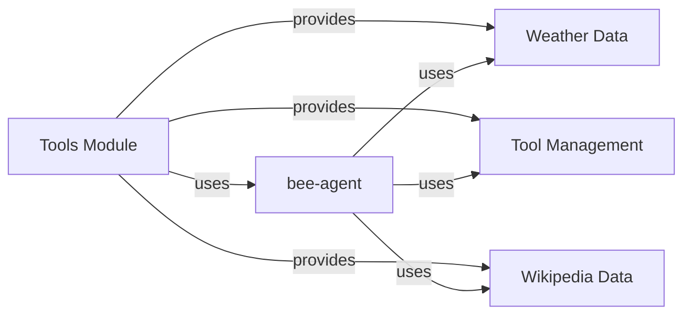
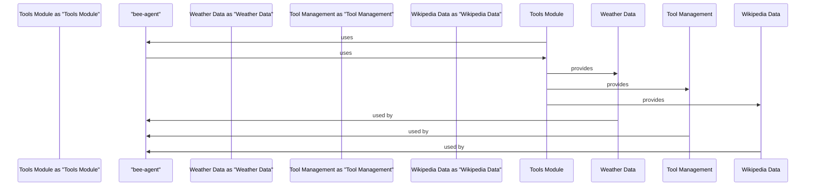

# Tools Module Documentation
## Introduction
The Tools Module is a crucial component of the bee-hive project, in particular are part of the Framework tools, aand anabled the Agents use them. The framework  providing various tools and utilities to support the development and use of the project. This documentation aims to provide a detailed understanding of the Tools Module, its classes, functions, and methods, as well as guidance on how to use and integrate it with other systems.

## Architecture
The Tools Module is located in the `bee_agent/tools` directory and consists of several sub-modules, including `weather.py`, `tool.py`, and `wikipedia.py`. Each sub-module provides a specific set of tools and utilities, such as weather data retrieval, tool management, and Wikipedia data access.

## Setup Instructions
To use the Tools Module, follow these setup instructions:

1. Clone the bee-hive repository using `git clone`.
2. Install the required dependencies using `poetry install`.
3. Import the Tools Module in your Python script using `from bee_agent.tools import *`.

## Examples
Here are some examples of using the Tools Module:

* Weather data retrieval: `weather.get_weather_data('London')`
* Tool management: `tool.create_tool('example_tool')`
* Wikipedia data access: `wikipedia.get_wikipedia_data('example_topic')`

## mermaid Art Diagrams
The following mermaid art diagram shows the relationships between the Tools Module and other components of the bee-hive project:

This diagram illustrates the dependences between the Tools Module and other components of the bee-hive project, such as the bee-agent, weather data, tool management, and Wikipedia data.

## Code References
The Tools Module is implemented in Python and uses various libraries and frameworks, such as `poetry` for dependency management and `git` for version control. The code is organized into several sub-modules, each providing a specific set of tools and utilities.

## Conclusion
The Tools Module is a crucial component of the bee-hive project, providing various tools and utilities to support the development and use of the project. By following the setup instructions and using the examples provided, developers can easily integrate the Tools Module with other systems and take advantage of its features.

## Component Relationships and Flows
The following mermaid art diagram shows the component relationships and flows of the Tools Module:
