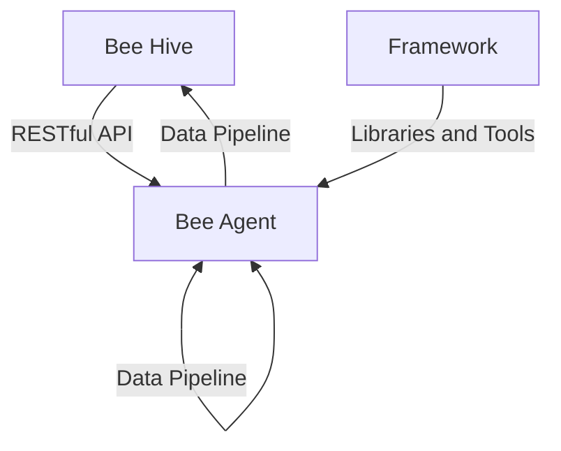

# High-Level Component Interactions
This document provides an overview of how the components of the bee-hive project interact with each other, including their communication and data exchange mechanisms.

## Project Structure
The bee-hive project consists of several key components, including the `bee-hive`, and use the `bee-agent frameworks` to build the agents. The `bee-hive` directory contains the configuration and tools for the hive. The `bee-agent framewors` contains the core logic for the Bee AI Agents, and is base in the same interface implementation for TypeScript and Python, more references: 
- [`bee-framework-ts`](https://github.com/i-am-bee/bee-agent-framework)
- [`bee-framework-py`](https://github.com/i-am-bee/bee-hive/tree/main/framework/bee-py) 

## Component Interactions
The components of the bee-hive project interact with each other through a series of APIs and data exchanges. The `bee-hive` help to deploy and stablish communication with/between `bee-agent` through a RESTful API, having the `framework` as provider of the main set of libraries and tools for building the `bee-agents`.

### Bee Agent Component
The `bee-agent` component is responsible for executing the core logic of the project. It interacts with the `bee-hive` component to retrieve configuration and data, and with the `framework` component to utilize the underlying libraries and tools.

### Bee Hive Component
The `bee-hive` component is responsible for storing and managing the configuration and data for the project. It interacts with the `bee-agent` component to provide configuration and data, and with the `framework` component to utilize the underlying libraries and tools.

### Framework Component
The `framework` component provides a set of libraries and tools for building and deploying the project. It interacts with the `bee-agent` and `bee-hive` components to provide underlying functionality and support.

## Data Flows
The components of the bee-hive project exchange data through a series of APIs and data pipelines. The `bee-agent` component retrieves configuration and data from the `bee-hive` component, and sends output and results back to the `bee-hive` component. The `framework` component provides a set of libraries and tools for building and deploying the project, and interacts with the `bee-agent` and `bee-hive` components to provide underlying functionality and support.

## Components Diagram

This diagram illustrates the high-level interactions between the components of the Bee project, including the communication and data exchange mechanisms.

## Setup Instructions
To set up the bee-hive project, follow these steps:

* Clone the repository from GitHub
* Run a local instance of the Bee Stack
* Install dependencies: `pip install -r ../../../bee-hive/requirements.txt`
* Configure environmental variables: `cp example.env .env`
* Copy `.env` to main bee-hive directory: `cp .env ../../../bee-hive`
* Create the agents: `./hive create agents.yaml`
* Open the UI ( http://localhost:3000 ) and enable the `OpenMateo` tool for both agents
* Run the workflow: `./hive run workflow.yaml` (to run for a different city, change the `prompt` field in `workflow.yaml`)
