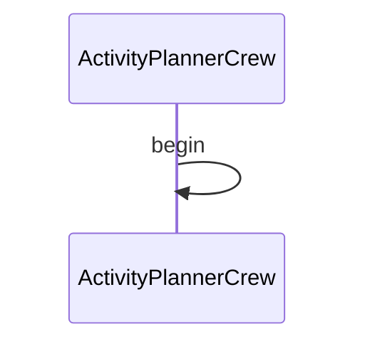

# Introduction

This is a simple demonstration of a workflow that uses a third party agent - in this case crew.ai

## Mermaid Diagram

<!-- MERMAID_START -->

<!-- MERMAID_END -->

## Requirements

* Python 3.11/3.12
* A valid project environment set-up by running the following from the root of the repository:
  * `poetry shell`
  * `poetry install`

## Running

* Run `demos/activity-planner-crewai.ai/run.py` via shell command line, or IDE such as vscode

## Caveats

* Demo is incomplete and still being worked on including but not limited to
  * Output from current agent cannot be parsed
* `run.sh`, `doctor.sh`. `setup.sh` are currently not implemented
* Demo is likely to be merged with `../activity-planner.ai`
