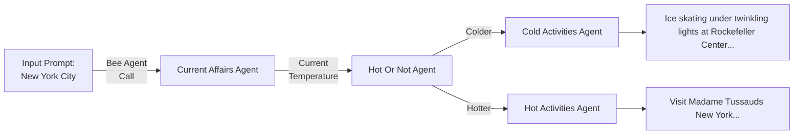

```mermaid
  flowchart LR;
    New_York_City["Input Prompt:<br/> New York City"]-->|Bee Agent<br/>Call|Current_Affairs_Agent["Current Affairs Agent"];
    Current_Affairs_Agent-->|Current<br/>Temperature|Hot_Or_Not_Agent["Hot Or Not Agent"];
    Hot_Or_Not_Agent-->|Colder|Cold_Activities_Agent["Cold Activities Agent"];
    Hot_Or_Not_Agent-->|Hotter|Hot_Activities_Agent["Hot Activities Agent"];
    Cold_Activities_Agent-->Final_Output_Cold["Ice skating under twinkling lights at Rockefeller Center..."];
    Hot_Activities_Agent-->Final_Output_Hot["Visit Madame Tussauds New York..."];
```
