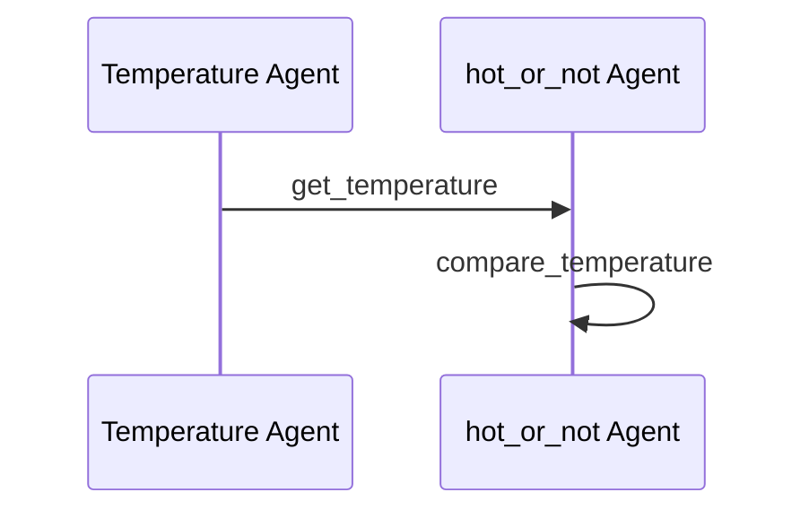

# Weather-Checker Example

A multi-agent workflow using Maestro to check if the current temperature in a location is hotter or colder than average.

## Mermaid Diagram

<!-- MERMAID_START -->

<!-- MERMAID_END -->

## Getting Started

* Run a local instance of the [bee-stack](https://github.com/i-am-bee/bee-stack/blob/main/README.md)

* Verify a valid llm is available to bee-stack

* Install [maestro](https://github.com/i-am-bee/beeai-labs) dependencies: `cd ../../../maestro && poetry shell && poetry install && cd -`

* Configure environmental variables: `cp example.env .env`

* Copy `.env` to common directory: `cp .env ./../common/src`

## Running workflow

Assuming you are in maestro level:

Create the agents (and enable the tools): `maestro create ./demos/workflows/weather-checker.ai/agents.yaml`

To run the workflow:

If you already created the agents and enabled the tool: `maestro run None ./demos/workflows/weather-checker.ai/workflow.yaml`

OR

Directly run the workflow: `maestro run ./demos/workflows/weather-checker.ai/agents.yaml ./demos/workflows/weather-checker.ai/workflow.yaml`

If in the actual weather demo directory, you can also directly run using: `./run.sh`.
(To run for a different city, change the `prompt` field in `workflow.yaml`)

### Installing Dependencies

Create a python3.11 virtual environment and activate
Install `pip3 install -r requirements.txt`, this is in the hive directory
Install `pip3 install -e .` in the maestro directory, which is the poetry lock file.
Need to further install any additional libraries.
CrewAI specific problem: `pip3 install crewai litellm==1.67.0.post1`
