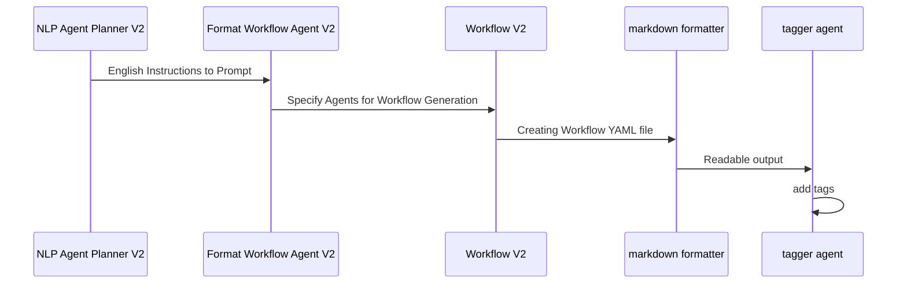

# META AGENT

Our goal is to create an agent that can create the relevant agents/workflow.yaml files necessary for you to delegate your tasks. Currently, because we are process of generalizing our prompts, currently the workflow is split into 2 files, `workflow_agent.yaml` and `workflow_workflow.yaml`.

## Mermaid Diagram of Agent Generation Workflow

<!-- MERMAID_START -->
```mermaid
sequenceDiagram
participant NLP Agent Planner V2
participant Format Input Agent V2
participant Create Agent YAML V2
participant markdown formatter
participant tagger agent
NLP Agent Planner V2->>Format Input Agent V2: English Instructions to Prompt
Format Input Agent V2->>Create Agent YAML V2: Specify Agents for Agent Generation
Create Agent YAML V2->>markdown formatter: Creating Agent YAML Workflow
markdown formatter->>tagger agent: Readable output
tagger agent->>tagger agent: add tags
```
<!-- MERMAID_END -->

## Mermaid Diagram of Workflow Generation Workflow

<!-- MERMAID_START -->

<!-- MERMAID_END -->

## Validating/Creating Agents/Workflow files

We can use the maestro commands to validate that our workflows are following the correct schema, and we can actually run them.

Assuming you are in maestro top level:

Validating the YAML file adheres to the schema:
`maestro validate ./schemas/agent_schema.json ./src/agents/meta_agent/agents.yaml`

Creating the agents(with the ability to manually add tools): `maestro create ./src/agents/meta_agent/agents.yaml`

To run the workflow: (Replace `workflow.yaml` with the desired workflow for now)

If you already created the agents and enabled the tool: `maestro run None ./src/agents/meta_agent/workflow.yaml`

OR

Directly run the workflow: `./src/agents/meta_agent/agents.yaml ./src/agents/meta_agent/workflow.yaml`

### Tools Needed to be Created

agent_schema tool: create by copying the code portion in the agents.yaml file into the tool.
workflow_schema tool: create by copying the code portion in the agents.yaml file into the tool.

Note:
The agents.yaml file currently is generalized, but workflow.yaml needs to specify the agents inside the prompt.
Specifically, the last prompt which creates the workflow.

2 solutions:

1) Add Human input in between workflow steps
2) Creating an initial agent that will output customized prompt based upon your agents, and this would be passed to the next agent
